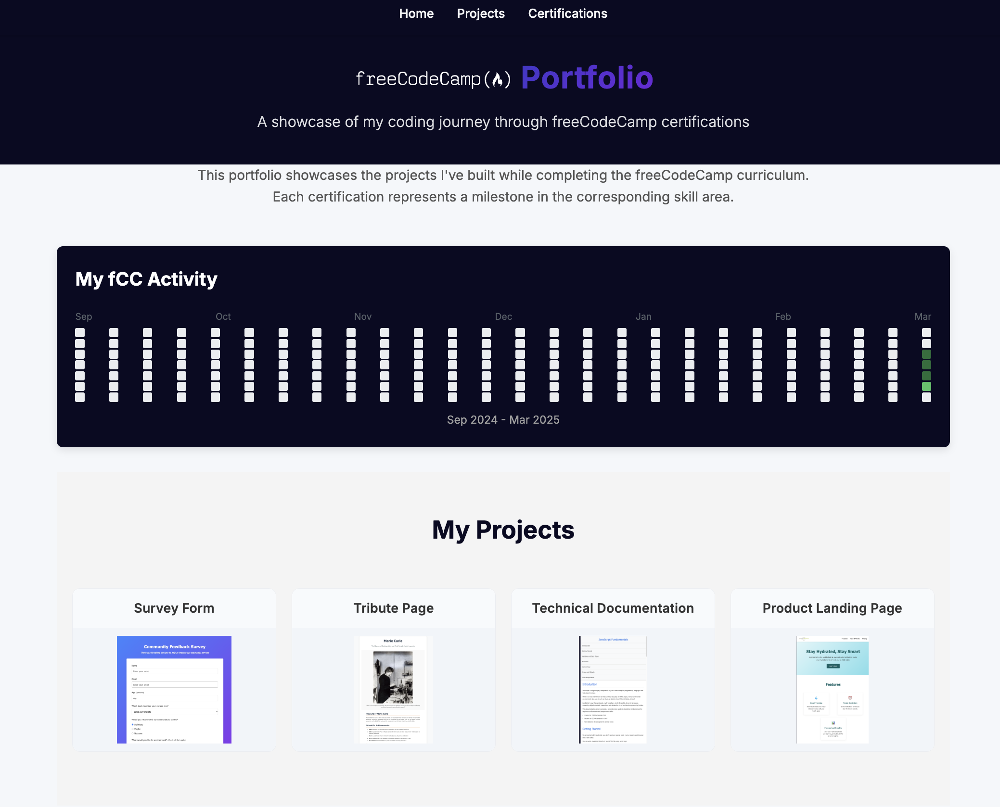

#  Projects

> **[View My Live Portfolio](https://uelkerd.github.io/fCC/)** - Browse all my freeCodeCamp projects in an interactive showcase!

## 📱 Interactive Portfolio Site

This repository not only contains the code for my  projects but also features a **fully interactive portfolio website** where you can:

- Explore all my projects in one place
- Navigate through different certification tracks
- View live demos of completed projects
- Track my progress through the freeCodeCamp curriculum

The site is built with modern HTML, CSS, and JavaScript and is automatically deployed through GitHub Pages.

---

## About freeCodeCamp

freeCodeCamp is a non-profit organization that consists of an interactive learning web platform, an online community forum, chat rooms, online publications and local organizations that intend to make learning web development accessible to anyone.

## Repository Structure

This repository is organized by certification tracks:

### Current Certifications

- **01 - Responsive Web Design Certification**
- **02 - JavaScript Algorithms and Data Structures Certification**
- **03 - Front End Development Libraries Certification**
- **04 - Data Visualization Certification**
- **05 - Relational Database Certification**
- **06 - Back End Development and APIs Certification**
- **07 - Quality Assurance Certification**
- **08 - Scientific Computing with Python Certification**
- **09 - Data Analysis with Python Certification**
- **10 - Information Security Certification**
- **11 - Machine Learning with Python Certification**
- **12 - College Algebra with Python Certification**

## Technologies Used

- HTML5 & CSS3
- JavaScript & ES6+
- React, Redux, Bootstrap, jQuery
- D3.js & Data Visualization Tools
- Node.js & Express
- MongoDB & Mongoose
- Python
- SQL & PostgreSQL
- Testing frameworks (Chai, Mocha)
- Information Security principles
- Machine Learning libraries
- And more!

## My Progress

| Certification                             | Status                                                                               |
| ----------------------------------------- | ------------------------------------------------------------------------------------ |
| Responsive Web Design                     | [Finished](https://www.freecodecamp.org/certification/uelkerd/responsive-web-design) |
| JavaScript Algorithms and Data Structures | Not Started                                                                          |
| Front End Development Libraries           | Not Started                                                                          |
| Data Visualization                        | Not Started                                                                          |
| Relational Database                       | Not Started                                                                          |
| Back End Development and APIs             | Not Started                                                                          |
| Quality Assurance                         | Not Started                                                                          |
| Scientific Computing with Python          | Not Started                                                                          |
| Data Analysis with Python                 | Not Started                                                                          |
| Information Security                      | Not Started                                                                          |
| Machine Learning with Python              | Not Started                                                                          |
| College Algebra with Python               | Not Started                                                                          |

## How to Navigate This Repository

Each folder represents a different certification or module from freeCodeCamp. Within each folder, you'll find individual projects and challenges I've completed.

## Connect With Me

- GitHub: [uelkerd](https://github.com/uelkerd)
- FreeCodeCamp: [uelkerd@fCC](https://www.freecodecamp.org/uelkerd)

---

## (This repository is continuously updated as I progress through the freeCodeCamp curriculum.)
